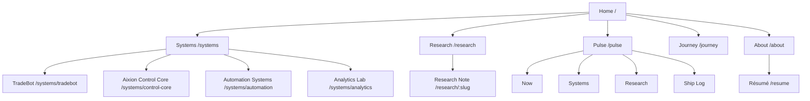
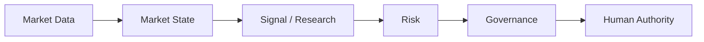
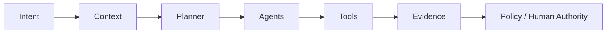
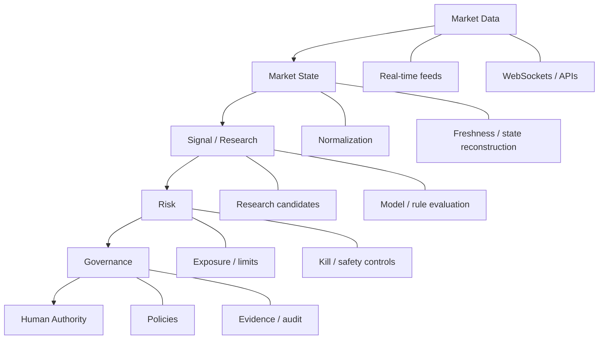
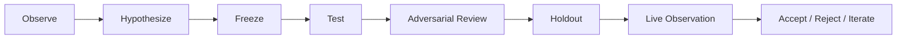
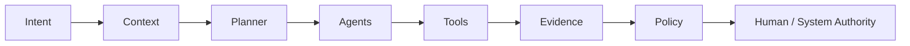
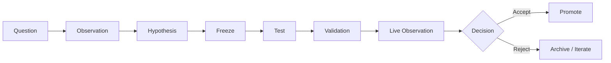
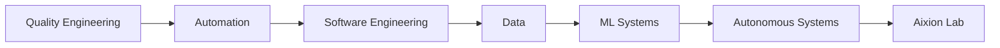
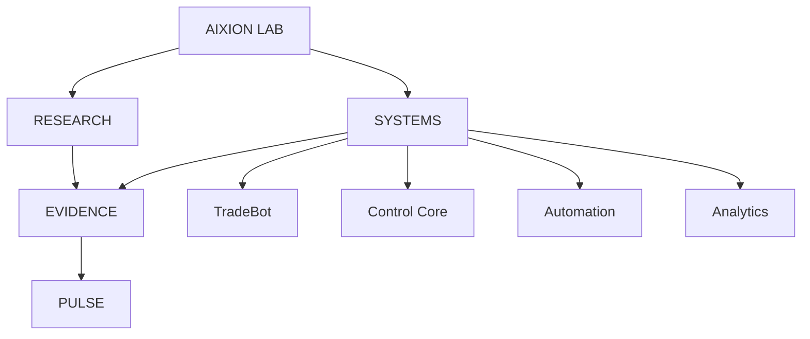

# AIXION LAB WEBSITE — MASTER BLUEPRINT

**Version:** 1.0 LOCKED  
**Authority date:** 2026-08-23  
**Status:** SOURCE OF TRUTH — APPROVED FOR CLEAN REBUILD  
**Repository:** `ramgolladi1503-sys/aixion-lab-website`  
**Authority path:** `docs/website/AIXION_WEBSITE_MASTER_BLUEPRINT.md`  
**Supersedes:** all previous website concepts, prompts, layouts, branches and implementation directions unless explicitly re-admitted by this document.  

---

# 0. Purpose

This document is the paper blueprint for `aixionlab.com`.

Treat it as if the entire website were being written, diagrammed and reviewed on paper before code is allowed to exist.

It defines:

- what Aixion Lab is;
- what the website must prove;
- what pages exist;
- what belongs on every page;
- exact navigation and tab structure;
- design language;
- system maturity language;
- public/private boundaries;
- desktop and mobile behavior;
- Aixion Signal;
- Aixion Pulse;
- Systems Registry;
- TradeBot presentation;
- Aixion Control Core presentation;
- Automation and Analytics presentation;
- Research Index and research-note structure;
- Evidence Drawer;
- engineering Decision Records;
- Journey and About;
- Lab/Career mode;
- recruiter fast path;
- System Map;
- command palette;
- build/release notes;
- accessibility;
- performance;
- GitHub-safe evidence integration;
- repository cleanup policy;
- implementation order;
- acceptance gates.

No implementation may invent a competing information architecture or visual concept without first changing this document deliberately.

---

# 1. Core identity

Aixion Lab is **not** a generic personal portfolio.

Aixion Lab is **not** a fake startup.

Aixion Lab is **not** a collection of technology badges.

Aixion Lab is an **evolving applied-engineering lab** where serious systems move through:

> Research → Build → Validate → Observe → Operate → Learn

Ram is clearly identified as the engineer behind the work.

The website itself must feel engineered: intentional, inspectable, evidence-driven, restrained, responsive and alive.

---

# 2. What the website must prove

A recruiter or engineering leader should understand within roughly 30–60 seconds that:

1. Ram builds substantial systems rather than tutorial projects.
2. TradeBot is a serious engineering and research platform, not simply a Python trading script.
3. Aixion Control Core is an emerging orchestration platform with a real MVP path.
4. Automation/RPA and Analytics/Tableau work show breadth without diluting the flagship systems.
5. Research is kept separate from production claims.
6. Failed hypotheses can be shown instead of hidden.
7. System state is observable.
8. Evidence exists behind major claims.
9. Quality engineering is part of the engineering philosophy rather than a past phase to hide.
10. Ram can reason about architecture, validation, failure recovery, automation, APIs, data, ML, observability and human authority.
11. Public storytelling does not leak private implementation details.
12. The website itself demonstrates disciplined engineering.

---

# 3. Brand

## Name

**AIXION LAB**

## Primary descriptor

**Applied intelligence, automation and decision systems.**

## Supporting statement

> An independent engineering lab where ideas move through research, implementation, validation and real-world observation.

## Attribution

**Built by Ram**  
Quality Engineering · Automation · Software · Data · Applied AI

---

# 4. Voice

The writing must be:

- technical but understandable;
- confident but not inflated;
- exact rather than promotional;
- evidence-oriented;
- calm;
- concise;
- honest about maturity.

Avoid:

- revolutionary;
- cutting-edge;
- game-changing;
- transforming the future;
- fake enterprise claims;
- fake telemetry;
- fake customers;
- fake adoption numbers;
- unsupported performance claims.

Preferred vocabulary:

`system · evidence · validation · observation · boundary · authority · state · architecture · experiment · candidate · research · decision · signal · orchestration · trace · reliability · failure · gate · proof`

---

# 5. Visual identity

## Palette

- Canvas: warm ivory / engineering-paper white
- Primary text: near black
- System surfaces: charcoal / midnight
- Primary signal: electric cobalt blue
- Operating/success: restrained green
- Building/MVP: restrained violet
- Development/warning: amber
- Rejected/critical: restrained red

## Typography

Use only three families/roles:

1. **Editorial serif** — hero statements, major titles, flagship names.
2. **Clean grotesk sans** — body, navigation, controls, cards.
3. **Monospace** — states, evidence, IDs, timestamps, traces, research metadata.

## Surface language

- large negative space;
- exact grid;
- thin technical dividers;
- light editorial pages interrupted by dark system surfaces;
- strong typographic hierarchy;
- small metadata;
- restrained icons;
- no glassmorphism-heavy treatment;
- no random glow cards;
- no generic AI robot imagery;
- no giant decorative 3D world.

---

# 6. Signature visual — Aixion Signal

A thin cobalt signal line connects the site.

It represents:

```text
IDEA
  ↓
RESEARCH
  ↓
BUILD
  ↓
VALIDATE
  ↓
OBSERVE
  ↓
OPERATE
  ↓
LEARN
  ↺
```

The Signal must always connect to meaning:

- system maturity;
- architecture flow;
- research lifecycle;
- evidence;
- Journey;
- Pulse.

Desktop: may curve horizontally or vertically between meaningful nodes.  
Mobile: mostly vertical, behaving like a timeline.  
Reduced motion: visible but static.

The Signal is **not decoration**.

---

# 7. Global navigation

Desktop:

```text
AIXION    SYSTEMS    RESEARCH    PULSE    JOURNEY    ABOUT        LAB / CAREER    GITHUB ↗
```

Mobile:

```text
[A] AIXION                                           [MENU]

Home
Systems
Research
Pulse
Journey
About
Career View
GitHub
Résumé
```

Do not create separate primary navigation items named Projects, Skills, Blog, Services, Dashboard or Contact.

---

# 8. Site map



---

# 9. Maturity model

Every system uses exactly one public state:

```text
CONCEPT
RESEARCH
BUILDING
VALIDATING
OPERATING
ARCHIVED
```

Meanings:

- **CONCEPT:** idea exists but has not entered structured research/build.
- **RESEARCH:** a question/mechanism/hypothesis is under investigation.
- **BUILDING:** implementation is underway.
- **VALIDATING:** implementation exists and is undergoing technical/evidence/live validation.
- **OPERATING:** running in its intended public-safe operating context.
- **ARCHIVED:** stopped, superseded or intentionally preserved.

Never use arbitrary completion percentages such as “78% complete.”

---

# 10. Public/private boundary

Every content object must be classifiable as:

```text
PUBLIC
SUMMARY_ONLY
PRIVATE
```

### PUBLIC

- architecture principles;
- technology categories;
- system state;
- sanitized evidence counts;
- selected screenshots;
- approved public GitHub proof;
- research methodology;
- high-level failure summaries.

### SUMMARY_ONLY

- research findings whose implementation is proprietary;
- selected live-runtime details;
- internal topology summaries;
- performance outcomes requiring context.

### PRIVATE

- exact trading strategy logic;
- signal parameters;
- secrets or credentials;
- proprietary datasets;
- execution rules;
- broker tokens;
- private endpoints;
- sensitive logs;
- raw operational evidence exposing internals.

The website must never render PRIVATE material.

---

# 11. Home `/`

## Goal

The visitor should immediately understand:

1. what Aixion is;
2. who is behind it;
3. what major systems exist;
4. what is active now;
5. why TradeBot matters;
6. where to go next.

## 11.1 Hero

Eyebrow:

`AIXION LAB`

Main statement:

**Applied intelligence, automation and decision systems.**

Supporting copy:

> An independent engineering lab where ideas move through research, implementation, validation and real-world observation.

Attribution:

**Built by Ram**  
Quality Engineering · Automation · Software · Data · Applied AI

CTAs:

- **Explore Systems →**
- **View Lab Pulse**
- `GitHub ↗`
- `Résumé ↓`

Visual behavior:

Aixion Signal enters the page through sparse technical coordinates. No hero video, 3D character, giant WebGL object or particle storm.

## 11.2 Lab Pulse preview

Heading:

**LAB PULSE**

Copy:

> What the lab is building, validating and learning right now.

Example system lane:

```text
TRADEBOT
RESEARCH ●──● BUILD ●──◉ VALIDATING ──◉ LIVE OBSERVATION ──○ OPERATING

CURRENT FOCUS
Evidence reconciliation and candidate validation

LATEST CHANGE
Validation-gate repair

NEXT GATE
Operational evidence review
```

```text
CONTROL CORE
RESEARCH ●──◉ BUILDING ──○ VALIDATING ──○ OPERATING

CURRENT FOCUS
MVP orchestration runtime

LATEST CHANGE
Tool-registry integration

NEXT GATE
Policy-bound execution trace
```

Allowed Pulse metrics:

- tests passing;
- milestones completed;
- active investigations;
- validation gates;
- live observations;
- evidence artifacts;
- public releases.

Forbidden Pulse metrics:

- hours worked;
- lines of code;
- raw commit count;
- fake effort score;
- arbitrary completion percent.

## 11.3 Featured Systems

Heading:

**Systems under development**

Systems:

1. TradeBot
2. Aixion Control Core
3. Automation Systems
4. Analytics Lab

Each card includes:

```text
SYSTEM ID
NAME
DOMAIN
STATE
CURRENT GATE
SHORT VALUE STATEMENT
VIEW SYSTEM →
```

## 11.4 TradeBot feature

Large dark system surface.

Title:

**TradeBot**

Descriptor:

> Governed market-intelligence infrastructure for intraday decision support.

Architecture preview:



Supporting copy:

> TradeBot is built around a simple principle: market data, research output and automated decisions should never silently become execution authority.

CTA:

**Explore TradeBot →**

## 11.5 Control Core feature

Title:

**Aixion Control Core**

State:

`BUILDING`

Descriptor:

> A governed orchestration layer for coordinating intent, context, agents, tools, policy, evidence and human authority.



CTA:

**Explore Control Core →**

## 11.6 Research preview

Heading:

**Research Notes**

> Questions, hypotheses, experiments and failures that shape the systems.

Each card:

```text
TITLE
DOMAIN
QUESTION
STATE
UPDATED
VIEW →
```

States may include:

`ACTIVE · HYPOTHESIS FROZEN · VALIDATED · REJECTED · ARCHIVED`

## 11.7 Journey preview

Heading:

**How the way I build evolved**

```text
QUALITY
  ↓
AUTOMATION
  ↓
SOFTWARE
  ↓
DATA
  ↓
ML
  ↓
AUTONOMOUS SYSTEMS
  ↓
AIXION LAB
```

Core sentence:

> Quality engineering taught me to distrust systems that cannot explain their state. That principle now shapes how I build automation, data and AI systems.

## 11.8 Footer

Left: `AIXION LAB`  
Center: `Engineering applied intelligence. Building systems that can explain their state.`  
Right: GitHub · LinkedIn · Email

Build metadata:

`AIXION LAB / BUILD YYYY.MM.DD`

Clicking the build number opens release notes.

---

# 12. Systems Registry `/systems`

Title:

**Systems Registry**

Subtitle:

> The engineered systems, tools and platforms being built inside Aixion Lab.

Filters:

```text
ALL
RESEARCH
BUILDING
VALIDATING
OPERATING
ARCHIVED
```

IDs:

```text
AX-SYS-001  TradeBot
AX-SYS-002  Aixion Control Core
AX-SYS-003  Automation Systems
AX-SYS-004  Analytics Lab
```

Each row/card:

```text
SYSTEM ID
NAME
DOMAIN
STATE
CURRENT GATE
LATEST EVIDENCE
LAST UPDATED
VIEW SYSTEM →
```

---

# 13. TradeBot `/systems/tradebot`

System ID: `AX-SYS-001`  
Launch state: `VALIDATING` unless current public-safe evidence justifies another state.

Tabs:

```text
OVERVIEW
ARCHITECTURE
ENGINEERING
RESEARCH
EVIDENCE
TIMELINE
```

## 13.1 Hero

Title:

**TradeBot**

Descriptor:

> Governed market-intelligence infrastructure for intraday decision support.

Supporting copy:

> A research and engineering platform combining real-time market data, state reconstruction, candidate research, risk controls, governance and human authority.

Metadata:

```text
DOMAIN        Market Intelligence
STATE         VALIDATING
CURRENT GATE  Live / evidence validation
VISIBILITY    Public architecture / private strategy
```

CTA: `View Evidence`

## 13.2 Architecture



Never publish proprietary strategy mechanics.

## 13.3 Engineering

### Live data integrity

> Real-time systems cannot assume that a connected feed is a healthy feed. TradeBot separates connection state, freshness state, subscription truth and evidence state.

Public concepts:

- freshness;
- subscription convergence;
- reconnect behavior;
- stale-feed prevention;
- observation evidence.

### Research authority

> A promising research result is not automatically an executable trading decision. Research candidates remain isolated until explicit validation and governance gates pass.

Public concepts:

- hypothesis freeze;
- dev/holdout separation;
- evidence gates;
- rejection;
- promotion control.

### Human authority

> The system may surface evidence and decision support while final execution authority remains explicitly bounded.

## 13.4 Research

Show methodology, not proprietary edge:



Selected public-safe subjects may include:

- opening-session market structure;
- options microstructure;
- regime behavior;
- evidence-bound market research.

## 13.5 Evidence

Evidence object:

```text
EVIDENCE TYPE
RESULT
DATE
SCOPE
AUTHORITY
PUBLIC PROOF
```

Example structure only:

```text
TYPE       Contract Validation
RESULT     PASS
SCOPE      Public-safe runtime contract
AUTHORITY  Frozen candidate
PROOF      GitHub ↗
```

```text
TYPE       Live Observation
RESULT     SEALED
SCOPE      Read-only observation
AUTHORITY  Non-execution
PROOF      Evidence summary ↗
```

Never invent metrics. Only expose values sourced from validated public-safe evidence.

## 13.6 Timeline

Milestones, not commit spam:

```text
DATE
MILESTONE
WHY IT MATTERED
PROOF
```

Selected failures may be milestones when they led to meaningful engineering changes.

---

# 14. Aixion Control Core `/systems/control-core`

System ID: `AX-SYS-002`  
State: `BUILDING`

Tabs:

```text
OVERVIEW
ARCHITECTURE
CAPABILITIES
MVP
EVIDENCE
ROADMAP
```

## 14.1 Hero

**Aixion Control Core**

> A governed orchestration layer for context, agents, tools, policy, evidence and human authority.

Supporting copy:

> Control Core explores how autonomous capabilities can be coordinated without losing observability, policy boundaries or explicit authority.

## 14.2 Architecture



Supporting layers:

```text
MEMORY
TOOL REGISTRY
MODEL REGISTRY
POLICY ENGINE
TRACE / AUDIT
STATE STORE
```

## 14.3 Capabilities

- Intent routing
- Context assembly
- Planning
- Agent coordination
- Tool execution
- Policy boundaries
- Evidence capture
- Human approval

## 14.4 Interactive architecture demo

Label exactly:

**INTERACTIVE ARCHITECTURE DEMO**

Example trace:

```text
10:42:11  INTENT      Research current market condition
10:42:12  CONTEXT     Sources resolved
10:42:14  PLANNER     Tasks decomposed
10:42:15  AGENT       Research capability assigned
10:42:19  TOOL        Data source queried
10:42:22  EVIDENCE    Result captured
10:42:24  POLICY      Review required
10:42:26  HUMAN       Awaiting authority
```

This is a demonstration of architecture behavior, not fake production telemetry.

## 14.5 MVP

Capability matrix:

```text
CAPABILITY                 STATE
Intent / planning          BUILDING
Context assembly           BUILDING
Agent runtime              BUILDING
Tool gateway               NEXT
Policy engine              PROTOTYPE
Evidence store             BUILDING
Human approval workflow    NEXT
```

Actual status later comes from the curated public-safe manifest.

---

# 15. Automation Systems `/systems/automation`

System ID: `AX-SYS-003`

Purpose: present workflow engineering, RPA and test/process automation without turning every small script into a project.

Content model:

```text
PROBLEM
WORKFLOW
AUTOMATION ARCHITECTURE
FAILURE HANDLING
OBSERVABILITY
OUTCOME
TOOLS
EVIDENCE
```

Primary work categories:

1. workflow/RPA orchestration;
2. QA/test automation infrastructure.

---

# 16. Analytics Lab `/systems/analytics`

System ID: `AX-SYS-004`

Purpose: show analytical reasoning, Tableau/data work and decision-support applications.

Content model:

```text
QUESTION
DATA
TRANSFORMATION
MODEL / LOGIC
VISUALIZATION
INSIGHT
VALIDATION
OUTCOME
```

Primary work categories:

1. Tableau decision dashboard;
2. data-quality / operational analytics study.

---

# 17. Research `/research`

Title:

**Research Notes**

Subtitle:

> Questions, hypotheses, experiments and failures that move the systems forward.

Filters:

```text
ALL
ACTIVE
VALIDATING
VALIDATED
REJECTED
ARCHIVED
```

Each note:

```text
TITLE
DOMAIN
QUESTION
METHOD
STATE
UPDATED
VIEW →
```

## Research note route

`/research/:slug`

Required order:

```text
QUESTION
WHY THIS MATTERS
OBSERVATION
HYPOTHESIS
METHOD
BOUNDARIES
EVIDENCE
RESULT
FAILURE MODES
STATUS
NEXT STEP
RELATED SYSTEM
```

A rejected result is a valid result.

Example:

```text
STATUS: REJECTED

The candidate did not demonstrate persistent structural edge
under the defined validation assumptions.

NEXT:
Archive the mechanism and retain its evidence for comparison.
```

---

# 18. Research lifecycle



The interface should always make clear where a study sits in this lifecycle.

---

# 19. Aixion Pulse `/pulse`

Title:

**Aixion Pulse**

Subtitle:

> What the lab is building, testing and learning right now.

Tabs:

```text
NOW
SYSTEMS
RESEARCH
SHIP LOG
```

## NOW

For each active system:

```text
CURRENT FOCUS
LATEST EVIDENCE
LATEST CHANGE
NEXT GATE
```

## SYSTEMS

Plot each system on:

```text
RESEARCH → BUILDING → VALIDATING → OPERATING
```

## RESEARCH

Show active hypotheses/studies with public-safe status.

## SHIP LOG

Curated engineering milestones only:

```text
DATE
SYSTEM
CHANGE
WHY IT MATTERS
PROOF
```

Do not mirror raw GitHub commit history.

---

# 20. Pulse data source

Pulse eventually reads from a curated manifest such as:

`content/lab-state.json`

Schema:

```json
{
  "updated_at": "YYYY-MM-DD",
  "systems": [
    {
      "id": "AX-SYS-001",
      "name": "TradeBot",
      "state": "VALIDATING",
      "current_focus": "...",
      "latest_milestone": "...",
      "next_gate": "...",
      "public_metrics": [],
      "public_evidence": []
    }
  ]
}
```

GitHub is never rendered as an unfiltered live database.

---

# 21. Evidence Drawer

Strong claims may include:

`VIEW EVIDENCE ↗`

Desktop: right-side drawer, approximately 420–520 px.  
Mobile: full-height sheet/view.

Evidence layout:

```text
TITLE
TYPE
RESULT
DATE
SCOPE
AUTHORITY
PROOF
```

Example structure:

```text
TRADEBOT / LIVE DATA RECOVERY

TYPE
Live observation

RESULT
PASS

DATE
21 Aug 2026

SCOPE
Feed health / evidence path

AUTHORITY
Read-only observation

PROOF
GitHub / sanitized artifact
```

Behavior:

- Escape closes;
- focus trapped while open;
- no background keyboard navigation;
- public/private boundary applies before rendering.

---

# 22. Engineering Decision Records

Selected architecture decisions are public.

Format:

```text
ADR-###
TITLE

CONTEXT
OPTIONS
DECISION
CONSEQUENCE
```

Examples:

### ADR-001 — Keep human execution authority explicit

Autonomous decision support may surface evidence, but execution remains a separate authority boundary.

### ADR-002 — Separate research evidence from runtime authority

Experimental success must never silently become production authority.

Decision Records demonstrate judgment, not just code.

---

# 23. Journey `/journey`

Title:

**Journey**

Subtitle:

> From quality engineering to applied systems engineering.



Core sentence:

> Quality engineering taught me to distrust systems that cannot explain their state. That principle now shapes how I build automation, data and AI systems.

Every stage answers:

```text
WHAT I LEARNED
WHAT I BUILT
WHAT CHANGED IN HOW I THINK
```

Do not duplicate the résumé chronologically.

---

# 24. About `/about`

Purpose: explain the engineer behind the lab.

Sections:

```text
ABOUT RAM
CURRENT FRONTIER
ENGINEERING PRINCIPLES
CAREER SNAPSHOT
CONTACT
```

Core direction:

> I build observable, testable and evidence-driven systems across quality engineering, automation, software, data and applied AI.

## Current Frontier

Show 3–4 themes, each linking to real work:

- Agent governance
- Market microstructure
- Evidence-bound automation
- Applied ML systems

---

# 25. Recruiter Fast Path

Career Mode exposes:

```text
CAREER SNAPSHOT

ROLE DIRECTION
QA / Automation / Applied AI / Systems Engineering

FLAGSHIP WORK
TradeBot
Aixion Control Core

CORE COMPETENCIES
Python
Java
Automation
APIs
WebSockets
Testing
CI/CD
Data
ML experimentation
System design
Observability

ACTIONS
Résumé
LinkedIn
GitHub
Contact
```

Do not create another primary navigation page for this.

---

# 26. LAB / CAREER mode

Global toggle:

`LAB / CAREER`

## LAB

Prioritizes:

- architecture;
- state;
- evidence;
- research;
- engineering language.

## CAREER

Adds competency annotations while keeping the same work.

TradeBot may translate to:

```text
Python
WebSockets
REST APIs
Real-time data
Automated testing
CI/CD
ML experimentation
Observability
Failure recovery
System architecture
```

Control Core may translate to:

```text
Agent orchestration
Tool integration
Policy architecture
Human-in-the-loop design
Evidence capture
API design
State management
```

Do not build two sites. Career Mode is a presentation layer over the same content model.

---

# 27. System Map



Use once as a concise overview, not as a decorative world map.

---

# 28. Command Palette

Desktop shortcut:

`⌘ K` / `Ctrl K`

Options:

```text
TradeBot
Control Core
Research
Pulse
Current work
Ram's résumé
Engineering evidence
GitHub
```

It must be keyboard-usable and genuinely useful.

---

# 29. Build number / release notes

Footer:

`AIXION LAB / BUILD YYYY.MM.DD`

Click → release notes.

Example:

```text
BUILD 2026.08.23
+ Locked master website blueprint
+ Added Lab Pulse architecture
+ Added Evidence Drawer model
+ Added Lab / Career mode
+ Added Systems Registry
+ Added honest rejected-research states
```

The website itself is treated as a maintained engineered product.

---

# 30. Contact

Do not end with “Contact me.”

Preferred heading:

**Build, test or discuss something difficult.**

Possible intents:

```text
Discuss an engineering role →
Talk about a system →
Collaborate on automation →
Discuss applied AI →
```

Methods:

- Email
- LinkedIn
- GitHub

Do not add a large contact form unless later evidence shows it is useful.

---

# 31. Mobile is first-class

Mobile is not desktop squeezed smaller.

## Hero

- compact masthead;
- strong title scale;
- controlled line length;
- stacked CTAs.

## Aixion Signal

Mostly vertical, timeline behavior.

## Architecture

Desktop:

```text
DATA → STATE → SIGNAL → RISK → GOVERNANCE → HUMAN
```

Mobile:

```text
DATA
 ↓
STATE
 ↓
SIGNAL
 ↓
RISK
 ↓
GOVERNANCE
 ↓
HUMAN
```

## Registry

Desktop table/rows become stacked cards.

## Evidence

Drawer becomes full-screen sheet.

## Navigation

No hover dependency. No tiny controls. No page-level horizontal overflow.

---

# 32. Accessibility

Required:

- semantic HTML;
- keyboard navigation;
- visible focus;
- accessible command palette;
- focus-trapped drawers/modals;
- Escape closure;
- appropriate contrast;
- reduced-motion support;
- no information conveyed by color alone;
- accessible state labels;
- correct heading hierarchy;
- alt text for meaningful graphics;
- decorative visuals hidden from assistive tech where appropriate.

---

# 33. Performance

Hard rule:

> No visual effect is allowed to make the website feel slower.

Requirements:

- useful server-rendered/fast first view;
- minimal JS above the fold;
- no giant videos;
- no blocking 3D engine;
- SVG/CSS preferred for Aixion Signal;
- technical diagrams animate only when useful/visible;
- optimized images;
- subsetted fonts;
- route-level code splitting;
- navigation never depends on animation.

---

# 34. Explicitly rejected directions

Do not build:

- anime characters;
- robots;
- giant 3D landscapes;
- building/city metaphors;
- floating planets;
- particle storms;
- fake AI-brain visuals;
- neon cyberpunk dashboard;
- endless glowing cards;
- fake live market values;
- fake customer logos/testimonials;
- fake product adoption numbers;
- arbitrary completion percentages;
- giant skill-logo walls;
- long loading sequence;
- WebGL as a basic navigation dependency;
- audio as a core interaction;
- scroll hijacking.

---

# 35. Approved reference-design set

Generated concept references are guidance, not pixel-perfect implementation authority.

### R1 — Home / Landing

- editorial light/dark contrast;
- Aixion Signal;
- Pulse;
- featured systems.

### R2 — Systems Registry

- system catalog;
- maturity state;
- current gate;
- evidence-first row/card model.

### R3 — TradeBot

- dark technical system surface;
- architecture;
- tabs;
- evidence;
- recruiter-readable engineering depth.

### R4 — Control Core

- orchestration architecture;
- capabilities;
- MVP state;
- execution trace.

### R5 — Research

- research as first-class engineering work;
- active/frozen/validated/rejected/archived states.

### R6 — Journey

- career evolution tied to engineering philosophy.

### R7 — Mobile

- Home, Systems, TradeBot, Pulse and Research must remain coherent at small sizes.

---

# 36. Repository authority policy

Repository:

`ramgolladi1503-sys/aixion-lab-website`

The pre-blueprint implementation is preserved separately in Git history/archive. It is **not** an implementation authority for the rebuild.

`main` should communicate one direction only:

1. this blueprint;
2. approved brand asset(s);
3. intentionally created new implementation as it is built from this blueprint.

Old design prompts, duplicate app implementations and obsolete visual experiments do not belong on `main` after the authority reset.

---

# 37. Legacy preservation and cleanup

Before the reset, preserve the previous `main` commit on:

`archive/pre-blueprint-rebuild-20260823`

Old PR branches may remain in Git history but their PRs should be closed as superseded.

The old implementation is not “lost”; it is deliberately removed from current authority so it cannot confuse new work.

Carry forward only intentionally justified assets. At authority reset, the existing authoritative Aixion brand image is preserved under `public/brand/`.

---

# 38. Proposed clean implementation structure

When implementation begins, target:

```text
aixion-lab-website/
│
├── app/
│   ├── page.tsx
│   ├── systems/
│   │   ├── page.tsx
│   │   ├── tradebot/page.tsx
│   │   ├── control-core/page.tsx
│   │   ├── automation/page.tsx
│   │   └── analytics/page.tsx
│   ├── research/
│   │   ├── page.tsx
│   │   └── [slug]/page.tsx
│   ├── pulse/page.tsx
│   ├── journey/page.tsx
│   ├── about/page.tsx
│   └── resume/page.tsx
│
├── components/
│   ├── layout/
│   ├── navigation/
│   ├── signal/
│   ├── systems/
│   ├── research/
│   ├── pulse/
│   ├── evidence/
│   ├── career/
│   ├── diagrams/
│   └── ui/
│
├── content/
│   ├── systems/
│   ├── research/
│   ├── decisions/
│   ├── releases/
│   └── lab-state.json
│
├── public/
│   ├── brand/
│   ├── evidence/
│   ├── systems/
│   └── resume/
│
├── docs/
│   ├── website/
│   │   ├── AIXION_WEBSITE_MASTER_BLUEPRINT.md
│   │   ├── CONTENT_MODEL.md
│   │   ├── PUBLIC_PRIVATE_BOUNDARY.md
│   │   ├── INTERACTION_SPEC.md
│   │   ├── RESPONSIVE_SPEC.md
│   │   └── ACCEPTANCE_GATES.md
│   └── rebuild/
│       ├── LEGACY_INVENTORY.md
│       └── MIGRATION_LOG.md
│
└── tests/
    ├── accessibility/
    ├── content/
    ├── routing/
    ├── visual/
    └── unit/
```

---

# 39. Default technical direction

Recommended starting point:

- Next.js
- TypeScript
- React
- restrained CSS system / Tailwind only if it does not flatten the design language
- SVG for Aixion Signal and architecture paths
- GSAP only where it communicates meaningful state
- structured content/MDX for research
- curated JSON manifest for Pulse
- Playwright for browser validation
- accessibility checks
- optimized image pipeline
- existing deployment provider only after deployment configuration is intentionally re-established

Do not introduce Three.js unless a specific interaction proves it adds real value.

---

# 40. Content model

## System

```text
id
slug
name
descriptor
domain
state
current_gate
current_focus
latest_milestone
next_gate
updated_at
visibility
competencies[]
architecture[]
evidence[]
decisions[]
timeline[]
```

## Research

```text
id
slug
title
domain
question
observation
hypothesis
method
boundaries
evidence
result
state
related_system
updated_at
visibility
```

## Evidence

```text
id
title
type
result
date
scope
authority
proof_url
visibility
```

## Decision Record

```text
id
title
context
options
decision
consequence
related_system
visibility
```

---

# 41. Context placement rule

Every significant page answers these questions in order:

```text
1. WHAT IS THIS?
2. WHY DOES IT EXIST?
3. HOW DOES IT WORK?
4. WHAT WAS HARD?
5. WHAT EVIDENCE EXISTS?
6. WHAT STATE IS IT IN?
7. WHAT COMES NEXT?
```

Do not begin project pages with technology stacks.

---

# 42. Project impact framework

Every major system includes:

```text
PROBLEM
ENGINEERING CHALLENGE
WHAT I BUILT
OUTCOME
```

Example — TradeBot:

```text
PROBLEM
Intraday market signals are noisy and live data can be unreliable.

ENGINEERING CHALLENGE
Separate data truth, research output, risk and execution authority.

WHAT I BUILT
A governed market-intelligence and validation system.

OUTCOME
A platform capable of structured research, read-only observation,
evidence capture and bounded decision support.
```

Example — Automation:

```text
PROBLEM
Operational workflows contain repetitive manual steps and weak auditability.

ENGINEERING CHALLENGE
Automate safely while preserving retries, visibility and failure handling.

WHAT I BUILT
A reusable workflow automation layer.

OUTCOME
Repeatable execution with traceability and reduced manual intervention.
```

---

# 43. Homepage order — desktop

```text
NAVIGATION
↓
HERO
↓
LAB PULSE
↓
FEATURED SYSTEMS
↓
TRADEBOT FEATURE
↓
CONTROL CORE FEATURE
↓
RESEARCH PREVIEW
↓
ENGINEERING EVIDENCE / PRINCIPLES
↓
JOURNEY PREVIEW
↓
CONTACT CTA
↓
FOOTER
```

---

# 44. Homepage order — mobile

```text
HEADER
↓
HERO
↓
PRIMARY CTA
↓
LAB PULSE
↓
TRADEBOT
↓
CONTROL CORE
↓
OTHER SYSTEMS
↓
RESEARCH
↓
JOURNEY
↓
CAREER SNAPSHOT
↓
CONTACT
↓
FOOTER
```

---

# 45. Interaction specification

Allowed high-value interactions:

- Aixion Signal progression;
- Lab/Career toggle;
- Evidence Drawer;
- command palette;
- system maturity focus details;
- architecture-stage focus;
- research-state filters;
- Pulse tabs;
- release-notes drawer;
- subtle card expansion;
- timeline progression.

Avoid:

- mouse-following blobs;
- scroll hijacking;
- excessive parallax;
- forced horizontal scrolling;
- sound;
- intro loader;
- replacement cursor;
- decorative 3D;
- motion on every text block.

---

# 46. Motion rules

Motion communicates state.

Good:

- Aixion Signal advances from Research to Validating while the user moves through a system story.
- Evidence Drawer enters after an explicit request for proof.

Bad:

- cards floating continuously;
- random hero text fly-ins;
- motion that blocks reading;
- animation required to access content.

---

# 47. Failure storytelling

Aixion may expose selected failures using:

```text
ENGINEERING NOTE

WHAT FAILED
WHY IT MATTERED
WHAT WAS LEARNED
WHAT CHANGED
OUTCOME
```

Example:

```text
WHAT FAILED
Subscription convergence diverged during live observation.

WHY IT MATTERED
A connected feed was not enough to prove complete market-data state.

WHAT CHANGED
Subscription authority and convergence checks were separated.

OUTCOME
The next validation path used an explicit convergence gate.
```

Failure, when contextualized and evidenced, demonstrates maturity.

---

# 48. SEO / metadata

Each page needs:

- unique title;
- unique description;
- OpenGraph image;
- canonical URL;
- structured metadata where useful;
- no keyword stuffing.

Examples:

`Aixion Lab — Applied Intelligence, Automation & Decision Systems`

`TradeBot — Market Intelligence Engineering | Aixion Lab`

`Aixion Control Core — Governed Agent Orchestration | Aixion Lab`

---

# 49. Résumé integration

Résumé accessible from:

- hero utility;
- About;
- Career Mode;
- recruiter fast path;
- command palette.

Prefer direct PDF plus concise HTML summary. Do not duplicate the entire résumé throughout the site.

---

# 50. Security/privacy

Never expose:

- secrets;
- `.env` values;
- auth tokens;
- broker identifiers;
- API keys;
- private endpoints;
- internal hostnames;
- sensitive logs;
- proprietary trading rules;
- personal addresses;
- unnecessary runtime metadata.

Public proof must be sanitized before publication.

---

# 51. Acceptance gates

## Gate 1 — Information Architecture

PASS only if:

- each page has one clear purpose;
- there are no duplicate page concepts;
- recruiter path is obvious;
- maturity language is consistent.

## Gate 2 — Content

PASS only if:

- flagship systems contain real copy;
- no lorem ipsum;
- no unsupported metrics;
- no fake product claims;
- research states are honest.

## Gate 3 — Visual System

PASS only if:

- hierarchy is consistent;
- spacing is deliberate;
- light/dark contrast works;
- Aixion Signal is meaningful;
- no generic AI-template appearance.

## Gate 4 — Responsive

PASS only if:

- mobile is intentionally composed;
- architecture remains understandable;
- no clipping;
- no page-level horizontal overflow;
- navigation remains usable.

## Gate 5 — Accessibility

PASS only if:

- keyboard navigation works;
- overlays are accessible;
- focus is visible;
- contrast is acceptable;
- reduced-motion works.

## Gate 6 — Performance

PASS only if:

- first view is fast;
- no unnecessary WebGL;
- no oversized assets;
- performance checks meet the agreed release bar.

## Gate 7 — Evidence

PASS only if:

- every public metric is sourced;
- proof links work;
- evidence UI never leaks private detail.

## Gate 8 — Production

PASS only if:

- domain routing works;
- canonical domain is correct;
- build passes;
- deployment is stable;
- metadata is correct;
- 404/500 states exist;
- analytics, if used, are intentionally configured.

---

# 52. Build sequence

Do not build everything at once.

## PASS 1 — Structure

Goal: perfect hierarchy and real content.

Build:

- routes;
- navigation;
- content model;
- static layouts;
- real copy;
- mobile structure.

No cinematic animation.

## PASS 2 — Visual System

Goal: static pages already look production-grade.

Build:

- typography;
- spacing;
- grid;
- color;
- system surfaces;
- diagrams;
- icon language.

## PASS 3 — Interaction

Goal: add meaningful behavior.

Build:

- Aixion Signal;
- Career Mode;
- Evidence Drawer;
- command palette;
- Pulse/research filters;
- release notes.

## PASS 4 — Evidence Integration

Goal: connect public-safe real state.

Build:

- `lab-state.json`;
- proof links;
- sanitized GitHub references;
- system metrics;
- selected releases.

## PASS 5 — Polish

Goal: production quality.

Build:

- responsive refinement;
- motion timing;
- accessibility;
- performance;
- SEO;
- error states;
- final visual QA.

---

# 53. Visitor success test

```text
Visitor opens aixionlab.com
        ↓
Understands Aixion in < 15 sec
        ↓
Sees active systems
        ↓
TradeBot catches attention
        ↓
Architecture proves depth
        ↓
Evidence proves credibility
        ↓
Career Mode translates work into competencies
        ↓
Journey explains QA → automation → systems evolution
        ↓
Recruiter opens résumé / LinkedIn / contact
```

---

# 54. Final locked identity

Aixion Lab must feel like:

> A living applied-engineering lab whose systems, research, evidence, progress and engineering decisions are visible through a carefully designed interface.

The unusual part is **not** a flashy animation.

The unusual part is making the engineering lifecycle visible:

```text
QUESTION
  ↓
RESEARCH
  ↓
BUILD
  ↓
VALIDATION
  ↓
EVIDENCE
  ↓
OPERATION
  ↓
LEARNING
```

That lifecycle is the brand.

---

# 55. Authority rule before implementation

The architecture in this document is now frozen as version 1.0.

Implementation may begin only by following the staged sequence above.

If a future design idea conflicts with this blueprint, the default action is **reject the idea**, not silently mutate the architecture.

A change to the fundamental architecture requires an explicit update to this document with a recorded reason.

---

# 56. Supporting documents to create during implementation

```text
docs/website/CONTENT_MODEL.md
docs/website/INTERACTION_SPEC.md
docs/website/RESPONSIVE_SPEC.md
docs/website/PUBLIC_PRIVATE_BOUNDARY.md
docs/website/ACCEPTANCE_GATES.md
docs/rebuild/LEGACY_INVENTORY.md
docs/rebuild/MIGRATION_LOG.md
```

These may elaborate the blueprint but may not contradict it.

---

# END STATE

The website is not “a portfolio with cool design.”

It is:

**Aixion Lab — an inspectable interface into serious engineering work.**

TradeBot is the flagship proof of systems depth.

Aixion Control Core shows the direction of future platform engineering.

Automation and Analytics show breadth.

Research shows intellectual rigor.

Pulse shows active progress.

Evidence shows credibility.

Journey explains the engineer.

Career Mode translates the work into recruiter language.

This document is the build authority.